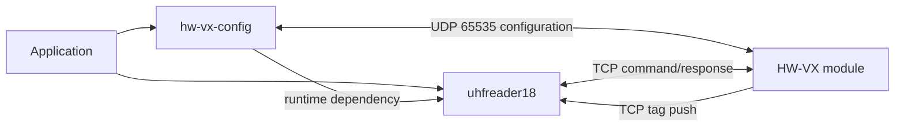

# hw-vx-config

[](https://pypi.org/project/hw-vx-config/)
[](https://pypi.org/project/hw-vx-config/)
[](LICENSE)
[](https://github.com/xynogen/hw-vx-config/actions/workflows/ci.yml)

Linux network configuration tool and Python library for HW-VX6330K /
HW-VX6346KL serial-to-Ethernet modules. Supports UDP discovery, network and
serial settings, remote-server configuration, DHCP, reboot, and RFID reader
commands.

`hw-vx-config` owns the HW-VX configuration plane. UHFReader18 command framing
and TCP communication come from its
[`uhfreader18`](https://github.com/xynogen/uhfreader18) dependency.

> Tested on Linux. macOS and Windows are not supported targets yet.

## Features

- Discover devices through limited broadcast on the same LAN/VLAN.
- Sweep every usable host in an IPv4 CIDR when broadcast cannot reach a device.
- Configure through unicast or broadcast-by-MAC.
- Read and write network, serial, remote-server, DHCP, and advanced settings.
- Reboot modules and change network addressing.
- Query RFID reader information and change reader address through `uhfreader18`.
- Use the interactive menu or scriptable CLI.
- Use `HwVxDevice` and `HwVxNetworking` directly from Python.

## Requirements

- Python 3.10 or newer
- Linux
- Device reachable on the local network
- UDP port 65535 permitted between host and module

## Install

```bash
pip install hw-vx-config
```

For isolated CLI use:

```bash
pipx install hw-vx-config
```

## Quick Start

```bash
# Discover modules through limited broadcast
hw-vx-config search

# Sweep one routed subnet
hw-vx-config search --network 172.27.43.64/28

# Show one module's complete configuration
hw-vx-config config 192.168.1.100
```

Running without arguments opens the interactive menu:

```bash
hw-vx-config
```

## CLI Reference

```bash
# Discovery
hw-vx-config search
hw-vx-config search --network 10.10.23.0/24

# Configuration
hw-vx-config config <ip>
hw-vx-config set-ip <current-ip> <new-ip>
hw-vx-config set-ip <current-ip> <new-ip> \
  --mask 255.255.255.0 --gateway 10.10.23.1
hw-vx-config dhcp <ip> on|off
hw-vx-config reboot <ip>

# Interactive UI
hw-vx-config interactive
```

### RFID Reader Commands

These commands connect to the module's configured TCP port and use
`uhfreader18.RfidClient` for the binary reader protocol.

```bash
# Discover reader address and print firmware, power, and scan time
hw-vx-config reader-info <ip> <port>

# Change discovered reader address
hw-vx-config set-reader-addr <ip> <port> <new-address>
```

For direct protocol use:

```python
from uhfreader18 import RfidClient

with RfidClient("192.168.1.100", 2077) as reader:
    info, address = reader.discover_address()
    print(address, info.version)
```

`RfidClient` moved from `hw_vx_config` to `uhfreader18` in
`hw-vx-config 2.0.0`:

```python
# 1.x
from hw_vx_config import RfidClient

# 2.x
from uhfreader18 import RfidClient
```

## Python Library

```python
from hw_vx_config import HwVxDevice, HwVxNetworking

with HwVxNetworking() as network:
    readers = network.search()

with HwVxDevice("192.168.1.100") as device:
    device.connect()
    config = device.get_config()
    print(config.ip_address, config.baud_rate)
```

See [`examples/library_usage.py`](examples/library_usage.py) and
[`examples/rfid_usage.py`](examples/rfid_usage.py).

## Package Relationship



| Package | Responsibility |
|:---|:---|
| `hw-vx-config` | HW-VX discovery, network/serial configuration, DHCP, reboot |
| `uhfreader18` | RFID command/response, CRC validation, tag push and heartbeat streams |

## Discovery Modes

### L2 broadcast

```bash
hw-vx-config search
```

Uses `255.255.255.255`. Fastest when host and module share a LAN/VLAN.

### CIDR sweep

```bash
hw-vx-config search --network 172.27.43.64/28
```

Sends discovery to every usable address with one UDP socket, then collects
responses. A prefixless value such as `10.10.23.0` defaults to `/24`.

## Troubleshooting

| Problem | Likely cause | Fix |
|:---|:---|:---|
| `search` returns nothing | Broadcast cannot cross router/VLAN | Use `search --network <cidr>` |
| `search` returns nothing | Firewall blocks UDP 65535 | Permit UDP 65535 inbound and outbound |
| Config command times out | Module IP changed or route is missing | Ping target and run discovery again |
| RFID command times out | Wrong TCP port or serial bridge issue | Verify module remote/serial settings |
| RFID broadcast gets no response | Reader power/address/serial wiring issue | Check power and serial wiring |

## Development

```bash
pip install -e ".[dev,typing,cov]"

ruff check src tests
ruff format --check src tests
mypy src
pytest
pytest --cov=hw_vx_config --cov-report=term-missing
python -m build
```

Tests mock network boundaries; no device is required.

CI runs lint, formatting, and tests on Python 3.10–3.13. Version tags such as
`v2.0.0` run CI before publishing through PyPI Trusted Publishing.

## Protocol and Documentation

- [`docs/api/`](docs/api/): per-module API reference
- [`docs/api/protocol.md`](docs/api/protocol.md): HW-VX and RFID protocol notes
- [`docs/DOCUMENTATION.md`](docs/DOCUMENTATION.md): UHFReader18 manual-derived reference
- [`uhfreader18`](https://github.com/xynogen/uhfreader18): maintained RFID protocol library

## Uninstall

```bash
pip uninstall hw-vx-config
# or
pipx uninstall hw-vx-config
```

## Tested With

- Hardware: HW-VX6330K, HW-VX6346KL
- Configuration protocol: UDP port 65535, ASCII request/reply
- RFID bridge: TCP to UHFReader18 serial protocol
- OS: Linux, including Ubuntu 22.04+

## License

MIT — see [`LICENSE`](LICENSE).
